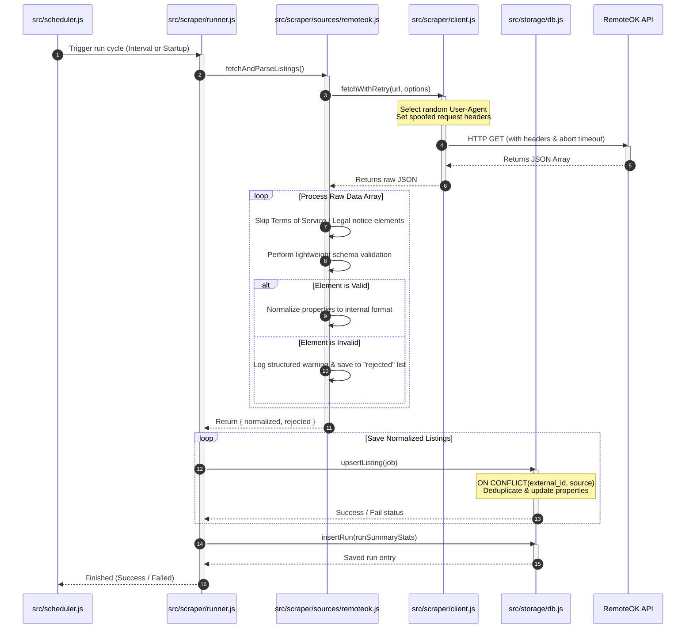

# Scraper Service Ingestion Design Document

This design document outlines the architecture, detection mitigation strategies, and resilience frameworks implemented for the job-listing ingestion service.

---

## 1. Detection Surface

When scraping hostile, detection-heavy targets (like LinkedIn or Indeed), anti-bot systems (e.g., Cloudflare, Akamai, PerimeterX) evaluate incoming connections across several distinct vectors to identify automated clients:

### Client Fingerprint Vectors
1. **Headless Browser Fingerprints**:
   - Automated browsers (Puppeteer, Playwright) expose properties like `navigator.webdriver = true` by default.
   - Mismatches in browser environment features, such as WebGL renderer names, canvas text rendering differences, incomplete plugin lists (`navigator.plugins`), or locale-timezone inconsistencies, easily leak automated status.
2. **TLS/JA3 Fingerprinting**:
   - Standard HTTP clients (like Node's native `fetch` or Python's `requests`) initiate TLS handshakes with default cipher suites and handshake parameters that differ significantly from native browsers (Chrome, Safari, Firefox). Firewalls compile these signatures into a JA3 fingerprint and cross-reference them with the claimed `User-Agent`.
3. **Request Pacing & Patterns**:
   - Sequential requests executed at exactly the same interval, or at inhuman speeds (sub-second navigation), expose robotic behaviour. Lack of user interactions like scroll, mouse moves, or keypresses also flag browser sessions.
4. **Header Inconsistencies**:
   - Modern browsers send headers in a specific order with modern security additions (`Sec-Fetch-Site`, `Sec-Fetch-Mode`, `Sec-Fetch-Dest`). Using old or custom clients with missing or incorrectly ordered headers is a key detection signal.
5. **IP-Based Reputation**:
   - IPs belonging to datacenter ASN ranges (AWS, DigitalOcean, GCP) have low trust scores. Target sites expect traffic from residential or consumer ISP blocks.

### Implemented vs. Advanced Mitigations
* **What this implementation handles**:
  - **Headers**: Spoofs realistic browser headers (`Accept`, `Accept-Language`, `Referer`, and `Sec-Fetch-*` properties) in `src/scraper/client.js`.
  - **User-Agent Rotation**: Dynamically rotates between 5 modern browser User-Agent strings.
  - **Pacing**: Uses randomized delay pacing (jitter between 1.5s and 4.0s) in `src/scraper/pacing.js` to disrupt predictable timing fingerprints.
  - **Backoff & Retries**: Implements exponential backoff with random jitter to gracefully recover from temporary rate limits without hammering the target.
* **What would be required for a hostile target (e.g. LinkedIn)**:
  - **Residential Proxies**: A rotating proxy pool (e.g., Bright Data, Oxylabs) to distribute requests across clean, residential IPs.
  - **Stealth Browsers**: Using Puppeteer/Playwright with plugins like `puppeteer-extra-plugin-stealth` to bypass browser feature detection.
  - **TLS Fingerprint Spoofing**: Integrating specialized HTTP clients (e.g., `curl-impersonate` or Node packages like `tls-client`) to align the TLS handshake signature with the browser specified in the `User-Agent`.

---

## 2. Ingestion Strategy

### Pacing and Jitter
The pacing module (`src/scraper/pacing.js`) implements a wait duration calculated as:
$$\text{Delay} = \text{random}(\text{min}, \text{max})$$
By default, this is set to wait between **1.5 and 4.0 seconds** between consecutive requests. This introduces high-entropy timing differences that break simple rate-counting heuristics.

### Session and Identity Management
- **RemoteOK API**: Public and stateless; no authentication or cookie sessions are required.
- **Hostile Targets**: For authenticating scrapers, we must maintain session persistence. This is achieved by:
  - Storing a session cookie jar associated with a specific user profile and proxy IP.
  - Ensuring that a session never changes IPs mid-run (which triggers security alerts like "Suspicious Login Activity").
  - Limiting the volume of scrapes per account/identity per day to stay well within typical human activity limits.

### Plan B (Fallback Strategy)
If the scraper gets blocked mid-run or blacklisted entirely, the pipeline executes the following fallbacks:
1. **Circuit Breaker**: Detects consecutive HTTP failures (like `403 Forbidden` or `429 Too Many Requests`). If 3 consecutive runs fail, it trips the circuit breaker, pausing further scheduled scrapes for a cooldown period (e.g., 2 hours).
2. **Alternative Source Fallback**: The runner catches the error and can automatically fallback to a secondary data source (e.g., fallback from scraping raw HTML to pulling from RSS feeds or alternative job boards).
3. **Proactive Alerting**: Rather than failing silently, the system logs the failure status (`status: 'failed'`) in the database `runs` table, which triggers alerting integrations (e.g., Webhooks to Slack, Discord, or email alerts) to notify developers immediately.

---

## 3. Resilience

### Fallback Parsing & Structured Logging
The parser (`src/scraper/sources/remoteok.js`) implements a resilient, non-blocking pipeline:
- The first element containing legal notices is parsed out using simple checks, bypassing unnecessary validation warnings.
- Validation checks are performed on every job item. If a listing is malformed (e.g. missing `company` or `url` fields due to an upstream schema drift), the listing is skipped and logged as a warning (`console.warn`) with the raw element's preview and the failure reason.
- Valid listings are still normalized and stored. A single corrupt record does **not** abort the entire ingestion run.

### Scenario Failure Recovery
- **Markup / Schema Change**: If the structure changes overnight (e.g. `position` field renamed to `job_title`), the validation schema catches the missing mandatory field, logs it as a warning, and continues. A sudden rise in the DB's `rejected_count` statistics (visible in `GET /status`) alerts developers that a parser rewrite is needed.
- **Rate-Limiting**: The HTTP client wrapper detects `429` status codes and initiates exponential backoff retries, backed by randomized pacing to allow the block to cool down.
- **Empty Responses**: If the target returns an empty array, the runner records a successful execution but with a `fetchedCount` of `0`. In a production monitoring dashboard, a check is set up to flag consecutive runs with `0` results as anomalous, indicating potential scraper blockage or endpoint changes.

---

## 4. Where You'd Stop: Ethical Boundaries

Ingesting data from the internet requires drawing a clear line between technical capability and ethical responsibility:

1. **API vs. Gatekeeping Bypass**: Scraping a public API designed for consumption (like RemoteOK) is clean. However, writing automation to circumvent authentication paywalls, bypass CAPTCHAs, or scraper-blockers behind private accounts is a line I won't cross for commercial scrapers.
2. **Respecting Site Policies**: We treat `robots.txt` and developer rate limits as an ethical floor. Even if technically evadable, scraping at rates that degrade target website performance (denial of service) or violates copyright is unacceptable.
3. **Data Privacy**: I will not scrape personal or private user data (such as emails, telephone numbers, or profile information of candidates). Scraping should be restricted to public, non-sensitive, business-level listings (like job details, company descriptions, and application URLs).
4. **Terms of Service**: While some site ToS terms are legally debatable (e.g., public indexable data), I refuse to engage in scraping where the ToS explicitly prohibits scraping and where doing so infringes on user privacy or violates active cease-and-desist notices.
